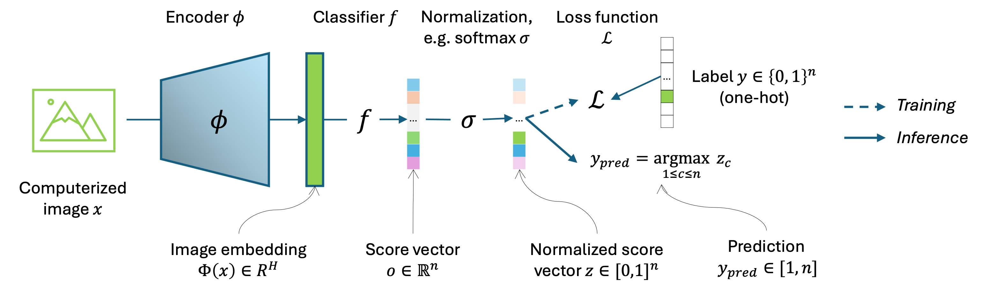
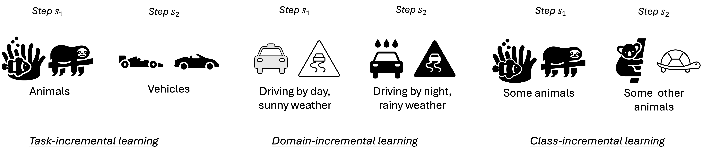
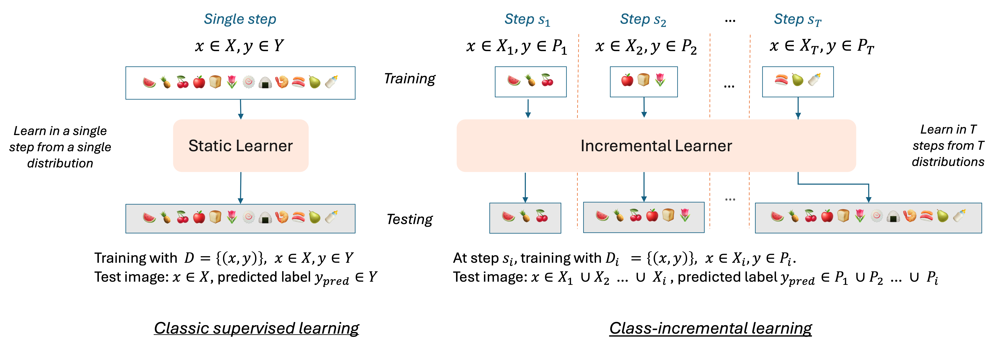
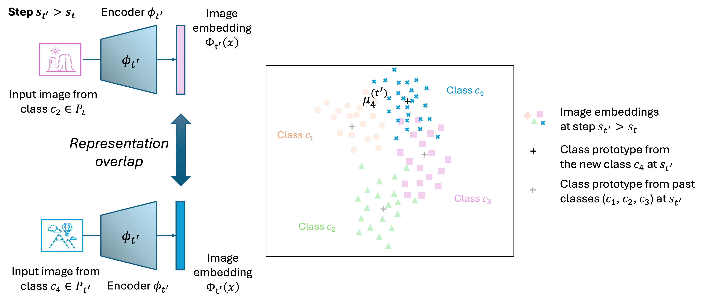
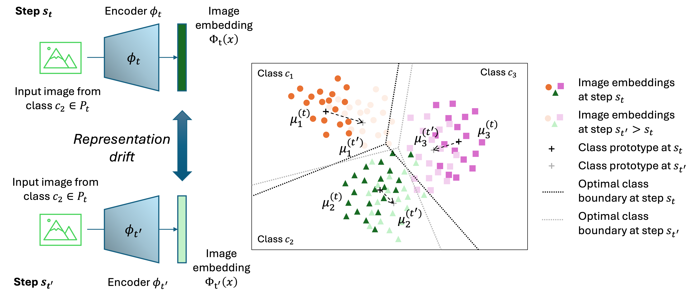

# Continual Learning Tutorial

Repository for PFIA 2025 - Tutorial on Continual Learning for Image Classification
---

The aim of this tutorial is to introduce the stakes, challenges and main algorithmic approaches of continual learning through practical exercises. It focuses on the main components of the recent algorithms proposed for learning an image classification model incrementally.

__Contents__

1. [Preliminaries](#part1)
2. [The incremental learning framework](#part2)
3. [Fine-tuning-based incremental learning methods](#part3)
4. [Incremental learning methods with a fixed encoder](#part4)
5. [Further reading on CIL](#part5)

[Citation](#cite)

[References](#refs)

___

## 1. Preliminaries <a name="part1"></a>

__Set-up__

To get started with the tutorial, clone this repository and 
create a virtual environment with either [conda](https://docs.conda.io/projects/conda/en/latest/user-guide/tasks/manage-environments.html) or [pip](https://python-guide-pt-br.readthedocs.io/fr/latest/dev/virtualenvs.html).
The name of the environment is "cil". 

```bash
git clone git@github.com:EvaJF/continual_tuto.git
cd continual_tuto
```

Conda version:
```bash
conda env create -f cil.yml
conda activate cil
```

Pip version:
```bash
python -m venv .cil
source .cil/bin/activate 
python -m pip install -r requirements.txt
```
We will use standard libraries for numerical computations (`numpy`), visualization (`matplotlib`) and deep learning (`torch`).

__Repository structure__

This repository contains scripts for training an image classification model following different methods. 
* Fine-tuning-based incremental learning methods are illustrated using the MNIST dataset. See `joint_expe.py` for classic joint learning, `vanilla_expe.py` for vanilla fine-tuning across incremental learning steps, `replay_expe.py` for replay strategies, `distillation_expe.py` for knowledge distillation.
* Incremental learning methods that are based on a fixed encoder are illustrated on larger scale datasets (Flowers-102, Food-101). See `ncm_expe.py` for the Nearest Class Mean classifier (Rebuffi et al., 2017), `dslda_expe.py` for Deep Streaming LDA (Hayes et al., 2020), `fecam1_expe.py` for FeCAM with a common covariance matrix and `fecamN_expe.py`for FeCAM with one covariance matrix per class (Goswami et al., 2024).
Utility functions, e.g. dataloaders and performance metrics, can be found under `utils_tuto`. 

Additionally, running the scripts will create the following folders. 
* `ckp` : to store model checkpoints
* `data` : to store images and their vector representations computed with an encoder, e.g. when using the Food-101 dataset :
    - `data/food-101` will contain the images, 
    - `data/features/food-101/resnet18_in1k/` will contain the vector representations of the images computed using a ResNet18 network pretrained on the ImageNet-1k dataset.
* `logs` : to store experimental results.

NB : Data will be downloaded in the next steps. 


__Basic training and inference pipeline of an image classification model__

Given $\mathcal{X} \subset \mathbb{R}^d$ an input domain and $\mathcal{Y} \subset \mathbb{N}^{n}$ a set of labels, let us consider a dataset $D$ defined as a set of pairs of the form $(x,y) \in \mathcal{X} \times \mathcal{Y}$, where $x$ is a computerized representation of an image and $y$ is a label associated with the image. Here, a label $y$ represents the class of an image.
In the following, we consider the case of a multi-class classification task with $n$ classes where $n \geq 2$.



A supervised classification problem consists of building a mapping function $`\mathcal{M}_\theta`$ that tries to relate $x$ to $y$ as closely as possible, i.e. for each $(x,y)\in D$, to have $\mathcal{M}_\theta(x)~\approx y$. This mapping function is referred to as a model. In this tutorial, the models we consider are neural networks. 

An image classification model can typically be decomposed into an encoder $\phi : \mathcal{X} \rightarrow \mathbb{R}^H$, also called *feature extractor*, and a classifier $f : \mathbb{R}^H \rightarrow \mathbb{R}^{n}$, i.e. $\mathcal{M}_\theta = f \circ \phi$.
The encoder produces a compact vector representation of the input image, called an *embedding* (or a *feature vector*, or a *latent representation*) and the classifier assigns a class to this representation. 

> In `joint_expe.py` we train a small convolutional neural network to classify handwritten digits using the MNIST dataset. This will be our starting point for the next experiments.
Joint training represents the ideal scenario in terms of final performance but assumes full availability of all classes from one end to another of model training, a hypothesis that not always holds. 

* Execute the script. Analyse the performance report and identify the hyperparameters of the experiment. 

```bash
python joint_expe.py
```

See [here](comments/comments_joint.md) for more detailed explanations on this first experiment. 

___

## 2. The incremental learning framework <a name="part2"></a>

The term *continual learning* was notably used by Ring in 1997 (Ring, 1997), with the following definition: « Continual learning is the constant development of increasingly complex behaviors, the
process of building more complicated skills on top of those already developed. »
The term *lifelong learning* is also used in the literature (Thrun, 1995)

In recent years, reasearch has focused on a particular form of continual learning, namely *incremental learning*. 

__Types of incremental learning__

The literature often distinguishes three types of incremental learning.
* In Task-Incremental Learning (TIL), the goal is to progressively learn a series of (semantically) distinct tasks. In practice, each data sample has a task identifier. Example : learning to recognize hand-written digits, then learning to classify handmade doodles.
* In Domain-Incremental Learning (DIL): the structure of the problem is the same across the learning steps (e.g. same number of classes), but the input distribution changes. Example : learning to recognize digits written by children, when learning to recognize digits written by adults. 
* In Class-Incremental Learning (CIL), a growing number of classes must be recognized, without task identity. Example: learning to recognize hand-written digits from 0 to 4, then learning to recognize hand-written digits from 5 to 9. This is the setting we will focus on in the rest of this tutorial.



Since it does not require the notion of task identifiers, CIL can be seen as a more general framework than TIL and DIL. Its challenging nature may also explain the fact that it has received a lot of attention from the continual learning community. 

__Class-incremental learning__



The objective of CIL is to train a model that integrates all classes of a dataset whose examples arrive in a stream.  
We consider a sequential learning process composed of $T$ non-overlapping steps $s_1, s_2,\dots,s_T$. 
For $t \in [1, T]$, a step $s_t$ consists of learning from the examples contained in a dataset $D_t$. 
Each data set $D_t$ corresponds to a set $P_t$ of classes so that each learning example in $D_t$ uses a class belonging to $P_{t}$. 
Each class is only present in a single dataset.

__Catastrophic forgetting and the stability-plasticity balance__

A major issue faced by continual learning models is their tendency to
forget previously acquired information when confronted with new information. This phenomenon is called *catastrophic forgetting* or *catastrophic interference*, as it is caused by the "interference" of new information
with previous information (French, 1999; McCloskey and Cohen, 1989). 

Some works in continual learning take inspiration from neuroscience. In particular, the terms of *stability* and *plasticity*, originally introduced to describe biological neural networks (Mermillod et al., 2013), are also found in the continual learning literature. 
* Stability refers to the ability to retain past information.
* Plasticity to the ability to take new information into account. 

Stability and plasticity are often presented as two complementary but competing aspects of learning. 

__Vanilla fine-tuning__

> In `vanilla_expe.py`, we implement the basic framework for learning MNIST digit classification incrementally (e.g. learning the 10 classes in five steps of 2 classes each instead of learning all 10 classes together). 

```bash 
python vanilla_expe.py
```

* Get familiar with the structure of the script: what has changed ?
Compare the training loop of `vanilla_expe.py`with the training loop of `joint_expe.py`. 

Incremental scenario set-up: Classes are introduced progressively (e.g. 2 at a time here).
```python
nb_init_cl = 2
nb_incr_cl = 2
nb_tot_cl = 10
nb_steps = (nb_tot_cl - nb_init_cl) // nb_incr_cl
```

The classes accessible at training time and the classes accessible at test time are different:  
```python
train_cl = range(nb_init_cl + nb_incr_cl * (step - 1), nb_curr_cl)
test_cl = range(nb_curr_cl)
```

Classification layer: In joint training, the classifier has a fixed output dimension (10 classes).
In fine-tuning, the output layer is expanded at each step via `update_fc`, preserving weights of existing classes and appending  weights for the new classes.
At each step, the model is tested on all classes seen so far.

Performance evaluation: We can use the final accuracy to compare with joint training. 
We can also compare different incremental learning algorithms based on two complementary indicators, namely average incremental accuracy and average forgetting.

* Run the script and compare the final test accuracy with the one obtained previously with the joint training strategy. Look at the confusion matrices. What happened ?

__If the parameters of a neural network are naively adjusted to the latest training data, a
procedure we refer to as *vanilla fine-tuning*, the model successively overfits to the latest training data and information that was useful for classifying the previous data may be forgotten, resulting in an abrupt degradation of the model's performance on past data.__ This corresponds to a high plasticity and low stability of the model.

__Evaluation__

The average incremental accuracy of a model trained over a $T$-step incremental process is defined as the average test accuracy of the model over the $T$ steps of the incremental process (Rebuffi et al., 2017). 
We denote it by $A$ and compute it as 
```math
A = \frac{1}{T} \sum_{i=1}^T Acc_i^{1:i},
``` 
where $Acc_i^{1:i}$ is the accuracy of the model $`\mathcal{M}_i`$ on test samples from $`\bigcup_{j=1}^i D_j`$, after performing the learning step $s_i$.

Implementation: in `vanilla_expe.py`, the variable `test_acc_list` contains the values $Acc_1^1, Acc_2^{1:2}, ... Acc_T^{1:T}$. We obtain the average incremental accuracy by computing the mean of this list. Note that here we chose not the weigh the terms of the sum. 

```python
print("\nAvg incr acc: {:.2f}".format(np.mean(test_acc_list)))
```

The average forgetting of a model trained over a $T$-step process is the average of the accuracy gaps $f_i, i \in [1,T-1]$, computed for each data subset $D_i$, as the difference between the best accuracy achieved for $D_i$ at any step $s_k$, with $k \leq i$, by a model $`\mathcal{M}_k`$, and the accuracy of the final model $`\mathcal{M}_T`$ on $`D_i`$. 
We denote it by $F$ and compute it as: 
```math
F = \frac{1}{T-1} \sum_{i=1}^{T-1} f_i
```
where $f_i$ is the individual forgetting, computed as $`f_i = \max_{i \leq k \leq T} Acc_k^i - Acc_T^i`$

Implementation : In `vanilla_expe.py`, the coefficient $i, j$ of the `acc_mat` matrix contains the accuracy $Acc_i^j$ of model $\mathcal{M}_i$ on the test samples from $D_j$. 
Note that we chose to compute forgetting at the task level here but we could also compute it at the class level. 

```python
max_acc = np.max(acc_mat, axis=0)
last_acc = acc_mat[-1]
f = np.average(max_acc-last_acc)
```
* In the performance report, look at the last matrix. Its  coefficient $(i, j)$ corresponds to $Acc_i^j$, the accuracy of model $\mathcal{M}_i$ on the test samples from $D_j$. 

* What could be improved in this vanilla fine-tuning experiment ? (Hint : validation set, learning rate, parameter selection).

NB : In CIL experiments, joint training is usually the high baseline, and 
vanilla fine-tuning the low baseline. 


__Further remarks on the challenges of CIL__

So what should we do ? 
Should we freeze the encoder in order to prevent forgetting ? But then, the encoder may not be well suited to the new classes. 
If we update the encoder, then how ?

* Representation overlap when encountering new classes



* Representation drift when updating the encoder 


Let's implement some of the main strategies for learning a classification problem incrementally.
___

## 3. Fine-tuning-based incremental learning methods <a name="part3"></a>

In this part of the tutorial, we focus on fine-tuning-based CIL methods, i.e. methods that update the encoder as well as the classifier.

__Replay / Usage of a memory buffer__

Some CIL methods assume the availability of a fixed-size memory buffer, which stores a small subset of past training samples (Rebuffi et al., 2017).
In this line of work, at any incremental step $s_i$​ with $i>1$, the training dataset is constructed as
$$D_i \cup B_{1:i−1}$$ 
where $D_i$​ is the current batch of data and $B_{1:i−1} ⊆ D_1 \cup D_2 \cup ... D_{i-1}$​ represents the buffer content. 
The buffer is used to mitigate forgetting by enabling the model to rehearse on representative examples from earlier tasks.

> In `replay_expe.py` we improve upon the previous vanilla fine-tuning method by adding a memory buffer. 

* Compare `replay_expe.py`with `vanilla_expe.py`. In particular, see the `Memory` class implemented under `utils_cil.dataset.py`.

* Run the script and compare the confusion matrices across the incremental upadates. What happens ? Compare the accuracy and forgetting values.

```bash
python replay_expe.py
```

* Memory size: Vary the number of samples in the replay buffer. How does it impact performance ?

```python
# replay strategy
max_size = 200  # try 800, 2000
```
* Sampling strategy: Comment on the sampling strategy. How could it be improved ? Implement a different sampling strategy. 

__Further reading on replay strategies__:
_Herding_ in iCaRL (Rebuffi et al. 2017);
Compressing samples (e.g. select pixels);
Optimizing the samples (Mnemonics by Li et al. 2020);
GDumb (Prabhu et al., 2020) greedily collects incoming training samples in a memory buffer and
then uses them to train a model from scratch at test time.
Bias Calibration method (BiC) by Wu et al. (2019): at each incremental step, a validation set is used to train an
additional layer appended to the network to compensate for the bias of the classification layer towards more recent classes.
Latent replay;
Generative replay;
Past examples can be used for knowledge distillation (see next subsection).

* Dealing with class imbalance: Replace the loss function with a weighted version. Is it effective ? What other strategies could you implement to deal with class imbalance ?

```python
CE_weights = [ 1-train_count_dict[k]/len(train_loader.dataset) for k in range(nb_curr_cl)]
print(f"Class weights {CE_weights}")
CE_weights = torch.tensor(CE_weights, device=device)
loss_fn = nn.CrossEntropyLoss(weight = CE_weights)
```

__Further reading on class imbalance__: Balanced Softmax for Incremental Learning by Jodelet el al. (2023). See implementation in `utils_tuto/loss.py`.

NB : The `BalancedCrossEntropy` class does not change the loss scaling per sample, but instead modifies the softmax distribution via logit adjustment. This is equivalent to shifting the logits using log class priors, and results in a prior-corrected prediction distribution. Thus, it is not equivalent to `CrossEntropyLoss(weight=...)`, which re-weights the loss per sample after softmax and is typically used to rebalance gradient contributions. In other words, `CrossEntropyLoss(weight=...)` is used to increase the loss for under-represented classes, whereas `BalancedCrossEntropy` is used to adjust predictions for class imbalance by biasing logits using prior frequencies.


__Knowledge distillation__

Knowledge Distillation was proposed by Bucilua et al. in 2006 for model compression and adapted for deep neural networks by Hinton et al. in 2015.
It is a method for transferring knowledge from a _teacher_ model $\mathcal{M}$ to a (usually smaller) _student_ model $\mathcal{M}'$. 
The parameters of the teacher model are kept fixed, while the parameters of the student network are updated so that it mimics the behavior of the teacher model.

For an input image $x$, let $z \in [0,1]^n$ and $z' \in [0,1]^n$ be the vectors corresponding to the scores computed after softmax by the teacher and student models, respectively. 
The loss function of the student model includes a term $\mathcal{L}_{KD}$ that penalizes a discrepancy between the output of the student model and the output of the teacher model. 

_Learning without forgetting_ (Li and Hoeim, 2016) was the first method to implement knowledge distillation in the case of incremental learning. 
At a given step $s_t$, for a given input sample $x \in D_t$, the knowledge distillation loss is used in combination with the classification loss to constrain the output of the current model to stay close to the output of the previous model. 
The teacher model is the previous model $\mathcal{M}_{t-1}$ obtained at step $s_{t-1}$ and the student model is the current model $\mathcal{M}_t$.

> In `distillation_expe.py` we implement the _Learning without forgetting method_. Note that this method was originally proposed without a memory buffer. 

* Run the code and play with the hyperparameters. Compare the final accuracy and the confusion matrices with the ones obtained in previous experiments.

```bash
python distillation_expe.py
```

Currently using [KL div](https://docs.pytorch.org/docs/stable/generated/torch.nn.functional.kl_div.html) ?? TODO check LwF paper It was L2
__TODO add regularisation and check how CE is computed to comply with LwF paper !!__


__Further reading on knowledge distillation in CIL__:
- KD on image embeddings (LUCIR by Hou et al., 2019, BSIL by Jodelet et al., 2022)
- KD on intermediary representations (PODNet by Douillard et al., 2020)

* Implement a variation of the knowledge distillation loss.
Implementation hint: see the cosine embedding loss [here](https://docs.pytorch.org/docs/stable/generated/torch.nn.CosineEmbeddingLoss.html)


> In `feature_distil_expe.py` we provide the basis for implementing feature distillation.

```bash
python feature_distil_expe.py
```

___

## 4. Incremental learning methods with a fixed encoder <a name="part4"></a>

In this section of the tutorial, we focus on incremental learning methods that use a fixed encoder, i.e. only the parameters of the classifier are updated. This line of work is also known as _classifier-incremental learning_. 

__Get the data__

In this part of the tutorial, we assume the encoder to be fixed. Hence, for a given image, no need to compute the forward pass of the encoder multiple times. We compute it once and store it for reuse. 

*Option 1 : Use pre-computed image features*. Download pre-computed features following these steps. These features are obtained using a ResNet18 network pre-trained on ImageNet-1k.

```
wget LINK TO ADD features.tar.gz
tar -xf features.tar.gz
tree -L 2 features
```

*Option 2 : Choose your own dataset and/or encoder.*

We provide a script for extracting features with a choice of dataset, model architecture and pre-training dataset, e.g. the following command will compute image representations for the images of Food-101 using a ViT-Small network pre-trained on the LVD-142m dataset.

```
python ftextract.py --dataset food-101 --archi vits --pretrain lvd142m
```

__NCM__

The _Nearest Mean Classifier_ (NCM) was first used in CIL by Rebuffi et aL. (2017).
NCM only stores the average feature vector of each class encountered during the incremental learning process.  

At test time, the feature vector $\phi(x)$ of an input sample $x$ is computed, and its distance to each of the average feature vectors of the classes seen so far is computed. 
The prediction is the class whose average feature vector is closest to the feature vector of the input sample: 
```math
y_{pred} = argmax_{c \in [1, n_{1:t} ]} dist(\phi(x), \mu_c),
```
where $dist$ is for example the Euclidean distance or the cosine similarity.

* Experiment with the NCM. Try different datasets, data splits, encoders. Compare the results.

```bash
python ncm_expe.py --dataset flowers102 --nb_init_cl 52 --nb_incr_cl 10 --nb_tot_cl 102 
```

When applied using an encoder trained on a large-scale dataset, NCM can be a challenging baseline for CIL algorithms.

__DSLDA__

_Deep Streaming Linear Discriminant Analysis_ (DSLDA) by Hayes et al. (2020) applies an LDA to the case of a streaming classification problem. 

It stores one average latent representation per class $`\mu_c \in \mathbb{R}^{H}`$ with an associated count $`\kappa_c \in \mathbb{R}`$ and a single shared covariance matrix $`\mathbf{\Sigma} \in \mathbb{R}^{(H, H)}`$. 
The mean vector of each class and the class count are updated online. 

For the $(k+1)-th$ sample $x_{k+1}$, with a latent representation $\phi(x_{k+1})$, and a label $y$, the new covariance matrix is computed as:
```math
\mathbf{\Sigma_{k+1}} = \frac{k \mathbf{\Sigma_k} + \Delta_k}{k+1}, 
```
where $\Delta_k$ is computed as :
```math
\Delta_k = \frac{k (\phi(x_{k+1}) - \mu_y)(\phi(x_{k+1}) - \mu_y)^\intercal}{k+1}
```

NB : The covariance may be kept fixed after the initial step (static version) or updated online.  In the static version, the inverse of the covariance matrix can be pre-computed and stored for inference. 
In the plastic version, the covariance matrix better reflects the most recent data distribution, but its inverse must be computed on the fly for inference, which demands more computation.

At inference, the score $o_c$ associated with a class $c$ is computed as $o_c = \Lambda\mu_c + b_c$ where $\Lambda$ is the precision matrix (i.e. the inverse of the covariance matrix, computed as $\Lambda = {[(1 - \epsilon) \mathbf{\Sigma} + \epsilon \mathbb{I}]}^{−1}$), 
and $b_c$ is the component of a bias vector $b \in \mathbb{R}^{n_{1:t}}$ which corresponds to class $c$. The bias can be updated online and is computed by: $b_c = - \frac{1}{2} (\mu_c \cdot \Lambda \mu_c)$.

```bash
python dslda_expe.py --dataset flowers102 --nb_init_cl 52 --nb_incr_cl 10 --nb_tot_cl 102 
```

__FeCAM__

FeCAM (Goswami et al., 2024) uses the Mahalanobis distance, computed using class means and second-order class statistics. The authors propose two versions of their algorithm.
Either (1) a single covariance matrix is stored and updated at each incremental step, or (2) a specific covariance matrix is computed for each class and stored for the rest of the incremental process. 

* In the first case, the common feature covariance matrix obtained at step $s_{t-1}$, denoted $\mathbf{\Sigma_{1:t-1}}$, is updated at step $s_t$ using the data samples from $D_t$ as follows: 
```math
\mathbf{\Sigma_{1:t}} = \frac{n_{1:t-1}}{n_{1:t}} \mathbf{\Sigma_{1:t-1}} + \frac{|P_t|}{n_{1:t}} \mathbf{\Sigma_{t}}
```
where $\mathbf{\Sigma_{t}}$ is the feature covariance matrix computed from the samples of $D_t$.

The prediction for a test sample $x$ is computed by: 
```math
y_{pred} = argmin_{c \in [1, n_{1:t}]} (\phi(x) - \mu_c)^\intercal(\mathbf{\Sigma_{1:t}})^{-1}(\phi(x) - \mu_c)
```

> See the implementation in `fecam1_expe.py`.

In the second case, a feature covariance matrix $\mathbf{\Sigma}^{(c)}$ is computed for each class $c$. 

To ensure that Mahalanobis distances are comparable across classes, each per-class covariance matrix is normalized by dividing each of its rows (and each of its columns) element-wise by the standard deviation of this row (and of this column, respectively) so that diagonal values are all equal to $1$.
We denote $\overline{\mathbf{\Sigma}}^{(c)}$ the normalized covariance matrix of class $c$.
Then, the prediction for a test sample $x$ is obtained by computing the score of each class using the specific covariance matrix of this class: 
```math
y_{pred} = argmin_{c \in [1, n_{1:t} ]} \; (\phi(x) - \mu_c)^\intercal(\mathbf{\overline{\mathbf{\Sigma}}^{(c)}})^{-1}(\phi(x) - \mu_c)
```

> See the implementation in `fecamN_expe.py`.

* Compare the performance gap between the two versions of FeCAM across different data scenarios (i.e. number of training samples per class to compute the covariance matrix).

```bash
python fecam1_expe.py --dataset flowers102 --nb_init_cl 52 --nb_incr_cl 10 --nb_tot_cl 102 
```

```bash
python fecamN_expe.py --dataset flowers102 --nb_init_cl 52 --nb_incr_cl 10 --nb_tot_cl 102
```
__Further reading on classifier-incremental learning__:

* latent replay (Ostapenko et al., 2022)
* FeTrIL (Petit et al., 2023)
* RanPAC (McDonnell et al., 2024)


## 5. Further reading on CIL <a name="part5"></a>

__Impact of the incremental learning scenario__ 

On the impact of the incremental learning scenario (model architecture, number of classes per step, number of incremental updates etc.) see the survey of Belouadah et al. (2021) and the recommendation method of Feillet et al. (2023).

__Impact of pre-training on incremental learning performance__

See the study of Petit et al. (2024), and of Feillet et al. (2025).

__Prompt-based methods__ 

A recent line of work proposes to dynamically prompt a pretrained transformer network to learn a growing number of classes. See for example the methods proposed by Wang et al. (2022) or Smith et al. (2023). 

__Surveys__

See the surveys of Verwimp et al. 2024,
Masana et al. 2022, 
De Lange et al. 2021, 
Belouadah et al. 2021, 
van de Ven et al. 2022.

__Useful repositories__

Code: [PyCIL](https://github.com/LAMDA-CL/PyCIL),
[Avalanche](https://github.com/ContinualAI/avalanche)

Papers: [Awesome continual learning](https://github.com/feifeiobama/Awesome-Continual-Learning),
[Awesome incremental learning](https://github.com/xialeiliu/Awesome-Incremental-Learning).

____

Before closing this tutorial, you may wish to uninstall the virtual environment you created.

* Conda 

```bash
conda deactivate
conda env remove --name cil
```
* Pip

```bash
deactivate
rm -r cil/
```
____

## Citation <a name="cite"></a>
This tutorial (and in particular, the illustrations) is based on my thesis manuscript. Please consider citing the manuscript if you wish to reuse some of the content ! 

```
@phdthesis{feillet:tel-05062088,
  TITLE = {{Analysis and Recommendation Methods for Class-Incremental Learning}},
  AUTHOR = {Feillet, Eva},
  URL = {https://theses.hal.science/tel-05062088},
  NUMBER = {2024UPAST166},
  SCHOOL = {{Universit{\'e} Paris-Saclay}},
  YEAR = {2024},
  MONTH = Dec,
  KEYWORDS = {Deep learning ; Continual learning ; Frugality ; Recommendation ; Image classification ; Apprentissage profond ; Apprentissage continu ; Frugalit{\'e} ; Recommandation ; Classification d'image},
  TYPE = {Theses},
  PDF = {https://theses.hal.science/tel-05062088v1/file/143947_FEILLET_2024_archivage.pdf},
  HAL_ID = {tel-05062088},
  HAL_VERSION = {v1},
}
```

Cite this repo 

```
@software{Feillet_Tutorial_on_Continual,
author = {Feillet, Eva and Popescu, Adrian and Hudelot, Céline},
license = {MIT},
title = {{Tutorial on Continual Learning for Image Classification}},
url = {https://github.com/EvaJF/continual_tuto},
version = {0.1}
}
```

___

## References <a name="refs"></a>

Belouadah, E., Popescu, A., and Kanellos, I. (2021). A comprehensive study of class incremental learning
algorithms for visual tasks. Neural Networks, 135:38–54.

Bucilua, C., Caruana, R., and Niculescu-Mizil, A. (2006). Model compression. Proceedings of the 12 th
ACM SIGKDD International Conference on Knowledge Discovery and Data Mining, 3.

De Lange, M., Aljundi, R., Masana, M., Parisot, S., Jia, X., Leonardis, A., Slabaugh, G., and Tuytelaars, T.
(2021). A continual learning survey: Defying forgetting in classification tasks. IEEE transactions on
pattern analysis and machine intelligence, 44(7):3366–3385.

Dohare, S., Sutton, R. S., and Mahmood, A. R. (2021). Continual backprop: Stochastic gradient descent
with persistent randomness. arXiv preprint arXiv:2108.06325.

Douillard, A., Cord, M., Ollion, C., Robert, T., and Valle, E. (2020). Podnet: Pooled outputs distillation for
small-tasks incremental learning. In Computer vision-ECCV 2020-16th European conference, Glasgow,
UK, August 23-28, 2020, Proceedings, Part XX, volume 12365, pages 86–102. Springer.

Feillet, E., Petit, G., Popescu, A., Reyboz, M., and Hudelot, C. (2023). Advisil - a class-incremental
learning advisor. In Proceedings of the IEEE/CVF Winter Conference on Applications of Computer
Vision, pages 2400–2409.

Feillet, Eva, Adrian Popescu, and Céline Hudelot. "A Reality Check on Pre-training for Exemplar-free Class-Incremental Learning." 2025 IEEE/CVF Winter Conference on Applications of Computer Vision (WACV). IEEE, 2025.

French, R. M. (1999). Catastrophic forgetting in connectionist networks. Trends in cognitive sciences,
3(4):128–135.

Goswami, D., Liu, Y., Twardowski, B., and van de Weijer, J. (2024). Fecam: Exploiting the heterogeneity
of class distributions in exemplar-free continual learning. Advances in Neural Information Processing
Systems, 36.

Hayes, T. L. and Kanan, C. (2020). Lifelong machine learning with deep streaming linear discriminant
analysis. In Proceedings of the IEEE/CVF Conference on Computer Vision and Pattern Recognition
Workshops, pages 220–221.

Hinton, G. E., Vinyals, O., and Dean, J. (2015). Distilling the knowledge in a neural network. CoRR,
abs/1503.02531.

Hou, S., Pan, X., Loy, C. C., Wang, Z., and Lin, D. (2019). Learning a unified classifier incrementally
via rebalancing. In IEEE Conference on Computer Vision and Pattern Recognition, CVPR 2019, Long
Beach, CA, USA, June 16-20, 2019, pages 831–839.

Jodelet, Q., Liu, X., and Murata, T. (2022). Balanced softmax cross-entropy for incremental learning with
and without memory. Computer Vision and Image Understanding, 225:103582.

Kirkpatrick, J., Pascanu, R., Rabinowitz, N., Veness, J., Desjardins, G., Rusu, A. A., Milan, K., Quan,
J., Ramalho, T., Grabska-Barwinska, A., et al. (2017). Overcoming catastrophic forgetting in neural
networks. Proceedings of the national academy of sciences, 114(13):3521–3526.

Lange, M. D., Aljundi, R., Masana, M., Parisot, S., Jia, X., Leonardis, A., Slabaugh, G. G., and Tuytelaars,
T. (2019). Continual learning: A comparative study on how to defy forgetting in classification tasks.
CoRR, abs/1909.08383.

Li, Z. and Hoiem, D. (2016). Learning without forgetting. In European Conference on Computer Vision,
ECCV.

Masana, M., Liu, X., Twardowski, B., Menta, M., Bagdanov, A. D., and Van De Weijer, J. (2022).
Class-incremental learning: survey and performance evaluation on image classification. IEEE TPAMI,
45(5):5513–5533.

McCloskey, M. and Cohen, N. J. (1989). Catastrophic interference in connectionist networks: The
sequential learning problem. The Psychology of Learning and Motivation, 24:104–169.

McDonnell, M. D., Gong, D., Parvaneh, A., Abbasnejad, E., and van den Hengel, A. (2024). Ranpac:
Random projections and pre-trained models for continual learning. Advances in Neural Information
Processing Systems, 36.

Mermillod, M., Bugaiska, A., and Bonin, P. (2013). The stability-plasticity dilemma: investigating
the continuum from catastrophic forgetting to age-limited learning effects. Frontiers in Psychology,
4:504–504.

Ostapenko, O., Lesort, T., Rodriguez, P., Arefin, M. R., Douillard, A., Rish, I., and Charlin, L. (2022).
Continual learning with foundation models: An empirical study of latent replay. In Chandar, S., Pascanu,
R., and Precup, D., editors, Proceedings of The 1st Conference on Lifelong Learning Agents, volume 199
of Proceedings of Machine Learning Research, pages 60–91. PMLR.

Petit, G., Soumm, M., Feillet, E., et al. (2024) "An analysis of initial training strategies for exemplar-free class-incremental learning." Proceedings of the IEEE/CVF Winter Conference on Applications of Computer Vision.

Petit, G., Popescu, A., Schindler, H., Picard, D., and Delezoide, B. (2023). Fetril: Feature translation
for exemplar-free class-incremental learning. In Proceedings of 

Prabhu, A., Torr, P. H., and Dokania, P. K. (2020). Gdumb: A simple approach that questions our progress
in continual learning. In European Conference on Computer Vision, pages 524–540. Springer.

Rebuffi, S., Kolesnikov, A., Sperl, G., and Lampert, C. H. (2017). icarl: Incremental classifier and
representation learning. In Conference on Computer Vision and Pattern Recognition, CVPR.

Ring, M. B. (1997). Child: A first step towards continual learning. Machine Learning, 28(1):77–104.

Smith, J. S., Karlinsky, L., Gutta, V., Cascante-Bonilla, P., Kim, D., Arbelle, A., Panda, R., Feris, R., and
Kira, Z. (2023a). Coda-prompt: Continual decomposed attention-based prompting for rehearsal-free
continual learning. In Proceedings of the IEEE/CVF Conference on Computer Vision and Pattern
Recognition, pages 11909–11919.

Thrun, S. (1995). A lifelong learning perspective for mobile robot control. In Intelligent robots and systems,
pages 201–214. Elsevier.

van de Ven, G. M., Tuytelaars, T., and Tolias, A. S. (2022). Three types of incremental learning. Nature
Machine Intelligence, 4(12):1185–1197.

Verwimp, Eli, et al. "Continual Learning: Applications and the Road Forward." Transactions on Machine Learning Research (2024).

Wang, Q.-W., Zhou, D.-W., Zhang, Y.-K., Zhan, D.-C., and Ye, H.-J. (2024). Few-shot class-incremental
learning via training-free prototype calibration. Advances in Neural Information Processing Systems, 36.

Wang, Z., Zhang, Z., Lee, C.-Y., Zhang, H., Sun, R., Ren, X., Su, G., Perot, V., Dy, J., and Pfister, T.
(2022). Learning to prompt for continual learning. In Proceedings of the IEEE/CVF Conference on
Computer Vision and Pattern Recognition, pages 139–149.

Wu, Y., Chen, Y., Wang, L., Ye, Y., Liu, Z., Guo, Y., and Fu, Y. (2019). Large scale incremental learning.
In IEEE Conference on Computer Vision and Pattern Recognition, CVPR 2019, Long Beach, CA, USA,
June 16-20, 2019, pages 374–382.

